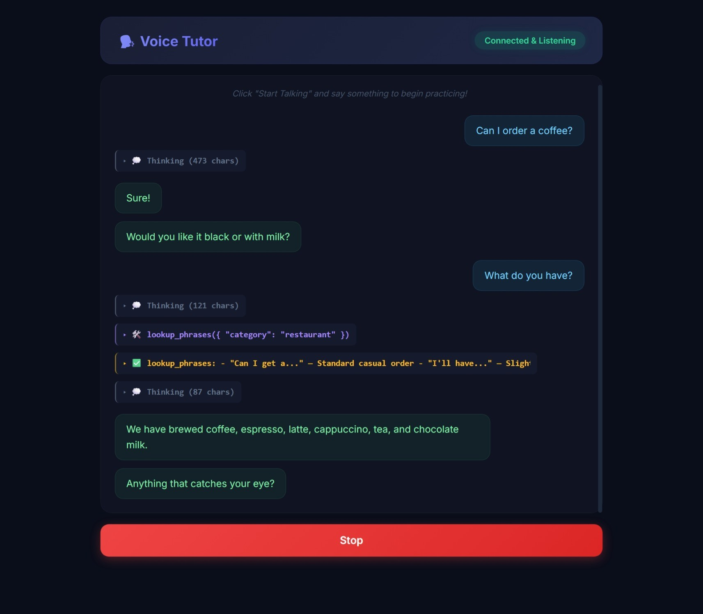

# realtime-voice-tutor

Real-time voice agent for casual English conversation practice. Speak naturally, role-play real situations (café, airport, office, party), get gentle grammar corrections, and interrupt the agent at any time.



## Features

- 🎙️ **Semantic VAD** with echo-aware dynamic thresholds (Silero ONNX)
- ⚡ **Barge-in interruption** with 4-step state reconstruction and grace-period protection
- 📝 **Streaming ASR** (Faster-Whisper `base.en` INT8)
- 🤖 **LLM via OpenAI-compatible endpoint** — works with Ollama (local or cloud), Groq, NVIDIA NIM, OpenAI itself. Tested with `llama3.2:3b`, `qwen3:0.6b`, `qwen3.5:2b`, `gpt-oss:20b-cloud`, `gemma4:cloud`.
- 🧠 **Agentic tool loop** with 4 MCP-style tools (get_scenario, lookup_phrases, check_vocabulary, suggest_topic) — visible in collapsible UI sections so you can see what the model is doing
- 💭 **Thinking tokens** captured from reasoning models (qwen3, gpt-oss, o1) and shown in a collapsible section
- 🔊 **Local Kokoro TTS** v1.0 with per-sentence streaming and markdown/emoji sanitization
- 🎨 **AudioWorklet-based browser UI** with proper native→16kHz resampling

## Latency

End-to-end timing depends almost entirely on which LLM you pick. Local models are fast; cloud models are smarter but pay network round-trip latency. Real numbers measured on a 2024 Mac mini (Apple M4, 16 GB RAM):

| Model | TTFA avg | TTFA max | Notes |
|---|---|---|---|
| `llama3.2:3b` (local) | **~1.5s** | 3.5s | Best balance for the POC — snappy + in-character |
| `qwen3:0.6b` (local) | ~0.7s | 1.5s | Fastest, but too small for quality role-play |
| `qwen3.5:2b` (local) | — | — | Unusable via OpenAI-compat (reasoning mode can't be disabled) |
| `gpt-oss:20b-cloud` | ~5s | 12s | Smart, proper tool use, but cloud latency kills realtime feel |
| `gemma4:cloud` | ~3s | 37s | Smart, but latency spikes make it unusable for voice |

Other stages (consistent regardless of LLM):

| Stage | Typical |
|---|---|
| ASR (`base.en` INT8) | ~350ms |
| TTS first chunk (Kokoro local) | ~80ms |
| VAD per chunk | ~2ms |
| Barge-in flush (client + server epoch cancel) | <50ms |

## Quick start

```bash
# 1. Install deps
uv sync

# 2. Download model files (one-time)
uv run python scripts/download_models.py

# 3. Start Ollama (or any OpenAI-compatible provider)
ollama pull llama3.2:3b          # recommended for the POC
ollama serve

# 4. Configure env (edit if needed — never overwrite existing .env)
cp .env.example .env

# 5. Run the server
uv run python -m voice_tutor.server
```

Open `http://localhost:8888` in Chrome. For LAN access or to use `0.0.0.0` / a LAN IP, you need HTTPS — see **Local HTTPS via Caddy** below.

## Local HTTPS via Caddy (required for non-localhost access)

Chrome's `getUserMedia` (microphone) requires a **secure context**. `http://localhost` counts as secure, but `http://<lan-ip>` or `http://0.0.0.0` does not — `navigator.mediaDevices` is undefined there. The fix is a local HTTPS proxy via Caddy + mkcert.

### One-time setup

```bash
# 1. Install Caddy and mkcert
brew install caddy mkcert

# 2. Install mkcert's root CA into the macOS keychain (prompts for sudo)
mkcert -install

# 3. Generate a cert with SANs for all the hostnames you'll use
LAN_IP=$(ipconfig getifaddr en0)        # e.g. 192.168.1.18
mkcert localhost 127.0.0.1 ::1 "$LAN_IP"

# 4. Move the certs to the location referenced by Caddyfile
mv localhost+3.pem static/tls-cert.pem
mv localhost+3-key.pem static/tls-key.pem
```

The certs are gitignored — never committed. If your LAN IP changes, regenerate.

### Run

```bash
# Terminal 1: backend (HTTP on :8888)
uv run python -m voice_tutor.server

# Terminal 2: Caddy proxy (HTTPS on :8443 → :8888)
caddy run --config Caddyfile
```

Open in Chrome:
- `https://localhost:8443` — same machine
- `https://192.168.1.18:8443` — LAN access (replace with your actual LAN IP)

If you see a cert warning after following the steps above, your browser didn't pick up the mkcert CA — retry `mkcert -install` or restart Chrome.

### Gotchas

- **`ERR_SSL_PROTOCOL_ERROR`**: Chrome caches HSTS / Alt-Svc headers. Open `chrome://net-internals/#hsts` → "Delete domain security policies" → enter the hostname. The Caddyfile disables HTTP/3 (`servers { protocols h1 h2 }`) for this reason.
- **Mixed-content WS error**: page is HTTPS but WebSocket is `ws://`. The UI already auto-switches to `wss://` based on `location.protocol`.
- **`0.0.0.0` is non-routable**: Chrome converts it to `127.0.0.1` internally, which breaks SNI matching. Use `localhost` or your LAN IP instead.
- **Cert SANs**: the cert must list every hostname you'll access via. Regenerate with `mkcert localhost 127.0.0.1 ::1 <new-ip>` if your setup changes.

## Helper scripts

```bash
scripts/restart-server.sh [--no-log]    # kill + restart + wait for health
scripts/download_models.py              # fetch silero_vad.onnx + kokoro v1.0
scripts/generate_test_fixtures.py       # synthesize Kokoro TTS fixtures for tests
```

## Tests

```bash
# Fast unit tests (no external services needed)
uv run pytest tests/ -m "not integration" -v

# Integration tests (require Ollama + Kokoro models downloaded)
uv run pytest tests/ -m integration -v
```

## Project structure

```
realtime-voice-tutor/
├── pyproject.toml              # uv project config & dependencies
├── Caddyfile                   # Local HTTPS proxy config
├── chatbox.jpeg                # Screenshot of the UI
├── src/voice_tutor/            # Package: all engine modules
│   ├── config.py               # Centralized env-driven config
│   ├── server.py               # FastAPI WebSocket orchestrator & barge-in
│   ├── engines.py              # Shared singleton registry (FastAPI lifespan)
│   ├── vad_engine.py           # Silero VAD with echo-aware thresholds
│   ├── asr_engine.py           # Faster-Whisper worker
│   ├── llm_engine.py           # OpenAI-compat streaming + tool loop
│   ├── tts_engine.py           # Kokoro local TTS (+ markdown sanitizer)
│   ├── mcp_tools.py            # 4 tool functions + OpenAI schemas
│   └── data_loader.py          # Markdown + frontmatter loader
├── data/                       # Scenarios + vocabulary (Markdown)
├── static/                     # Browser UI (HTML + AudioWorklet)
├── scripts/                    # download_models.py, restart-server.sh, etc.
├── tests/                      # pytest unit + integration tests
└── docs/                       # Design notes (PLAN.md, COMMIT_PLAN.md)
```

## Limitations (POC)

- No WebSocket auth
- No conversation persistence
- English-only
- Single-user load-testing
- Latency dominated by LLM choice — sub-500ms TTFA only achievable with very small local models that are too weak for quality role-play
