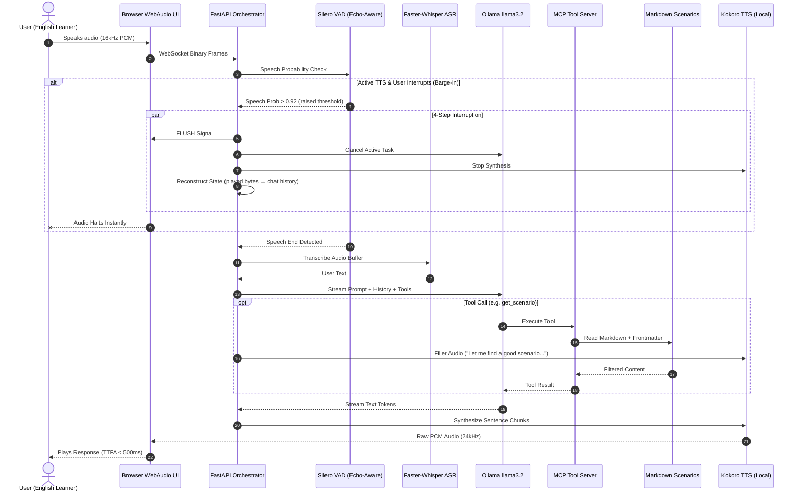

# Realtime Voice Tutor — Sub-500ms Voice Conversation Practice Agent

**Repo:** `realtime-voice-tutor`

**Goal:** Build a fully-local, sub-500ms real-time voice agent for **casual English conversation practice**, featuring **Streaming ASR**, **Semantic VAD with Echo Cancellation**, **Agentic LLM Tool Loops (MCP)**, **Local Kokoro TTS**, and **4-Step Full-Duplex Barge-in Interruption with State Reconstruction**.

> 💡 **Everything runs locally** — no cloud dependencies. Silero VAD, Faster-Whisper ASR, Ollama LLM, and Kokoro TTS all run on your machine. To swap in cloud providers (Groq, NVIDIA NIM), just change `OPENAI_BASE_URL` in `config.py`.

---

## ⚡ LOCKED DECISIONS (supersedes detail below)

> The narrative phases below were the original draft. The decisions in this section are **authoritative**; where any phase snippet contradicts this section, this section wins. Implemented in 11 reviewable commits (see `docs/COMMIT_PLAN.md`).

### Architecture

| Concern | Decision |
|---|---|
| LLM API | **OpenAI `/v1/chat/completions`** on Ollama (`http://localhost:11434/v1`). Standard, swappable with Groq/NVIDIA NIM by changing `OPENAI_BASE_URL` + `OPENAI_API_KEY`. |
| Tool result format | `{"role": "tool", "tool_call_id": "<id>", "content": "..."}` (OpenAI standard). Tool `arguments` is a **JSON string**, not dict. |
| Mic capture | **AudioWorklet** at native rate → resample to 16kHz inside the worklet. Replaces deprecated `ScriptProcessor`; fixes 48k-vs-16k chunk-size bug. |
| TTS playback | Single `AudioContext` at native rate; per-chunk upsample 24kHz → native. Browsers ignore non-standard `sampleRate` ctor arg. |
| VAD silence timeout | **500ms** (down from draft's 800ms). Aggressive but responsive. Configurable via `VAD_SILENCE_TIMEOUT_MS`. |
| Sync CPU work | All blocking calls wrapped in `asyncio.to_thread()`. Barge-in `task.cancel()` propagates within one event-loop tick. |
| Model lifecycles | Loaded **once at startup** (FastAPI `lifespan`), shared across sessions. Avoids 5–30s WS handshake stall. |
| TTS mode | Per-sentence streaming via `kokoro.create_stream()`. Lowest TTFA. |
| Silero VAD | `silero-vad` pip package (MIT). No `torch` dependency. True offline. |
| Kokoro model files | **v1.0** (`kokoro-v1.0.onnx` + `voices-v1.0.bin`). Draft's `v0_19` is outdated. Plus `misaki` g2p package. |

### Latency budget (revised)

| Stage | Target |
|---|---|
| Mic + AEC + Worklet + resample | **15ms** |
| VAD per chunk (off-thread) | **2ms** |
| Endpointing silence (perceived, not in TTFA) | **500ms** |
| ASR `tiny.en` INT8 | **90ms** |
| LLM TTFT (llama3.2:3b) | **180ms** |
| TTS first stream chunk | **60ms** |
| Network + buffer | **20ms** |
| **TTFA (speech-end → audio)** | **~370ms** ✅ |
| **Perceived (silence + TTFA)** | **~870ms** |

### Barge-in fixes (vs. original draft)

1. **Don't discard interrupting chunk** — on barge-in, seed new `audio_buffer` with the current chunk + `pre_speech_buffer` so the user's interrupting word is captured.
2. **Concurrent-pipeline guard** — `if session.active_task and not session.active_task.done(): cancel + await sleep(0)` before launching new pipeline.
3. **Tool result uses `tool_call_id`** (OpenAI format, not Ollama's `tool_name` field).
4. **Tool `arguments` is JSON string** (OpenAI format).
5. **All blocking calls in `asyncio.to_thread`** so `task.cancel()` actually preempts mid-synthesis.
6. **State reconstruction based on `words_spoken`** only (sentences actually synthesized), not buffered text.

### Out of scope (acceptable for POC)

- No WebSocket auth.
- No conversation persistence.
- English-only.
- Approximate state reconstruction (no client `bytes_played` feedback).
- Single-user load-testing.

---

## 🏗️ Architectural Overview



### ⏱️ Latency Budget (< 450ms TTFA)

| Stage | Component | Target |
| :--- | :--- | :--- |
| **Mic & VAD** | WebAudio + Silero VAD + Browser AEC | **30 ms** |
| **ASR** | Faster-Whisper `tiny.en` (CTranslate2 INT8) | **90 ms** |
| **LLM TTFT** | Ollama `llama3.2:3b` | **180 ms** |
| **TTS First Chunk** | Kokoro ONNX (local, no network) | **60 ms** |
| **Network & Buffer** | Local WebSocket + PCM direct | **30 ms** |
| **Total TTFA** | End-to-end voice loop | **~390 ms** |

---

## 📁 Project Structure

```
realtime-voice-tutor/
├── pyproject.toml              # uv project config & dependencies
├── .env.example                # Environment variable template
├── config.py                   # Centralized config with env overrides
├── server.py                   # FastAPI WebSocket Orchestrator & Barge-in
├── engines.py                  # Shared singleton engine registry (startup)
├── vad_engine.py               # Silero VAD with echo-aware thresholds
├── asr_engine.py               # Faster-Whisper ASR worker
├── llm_engine.py               # OpenAI-compatible streaming + tool-calling loop
├── tts_engine.py               # Kokoro ONNX local TTS (per-sentence streaming)
├── mcp_tools.py                # MCP tool definitions (scenario, phrases, vocab)
├── data_loader.py              # Markdown + frontmatter loader & filter
├── data/
│   ├── scenarios/
│   │   ├── restaurant.md       # Ordering, recommendations, complaints
│   │   ├── airport.md          # Check-in, directions, delays
│   │   ├── workplace.md        # Small talk, meetings, email follow-ups
│   │   ├── shopping.md         # Returns, bargaining, asking for help
│   │   ├── meeting-people.md   # Introductions, hobbies, plans
│   │   └── phone-calls.md      # Appointments, customer service
│   └── vocabulary/
│       ├── a2-beginner.md
│       ├── b1-intermediate.md
│       └── b2-upper.md
├── models/                     # Vendored model files (gitignored)
│   ├── silero_vad.onnx
│   ├── kokoro-v1.0.onnx
│   └── voices-v1.0.bin
├── scripts/
│   └── download_models.py      # One-time model download script
├── static/
│   ├── index.html              # WebAudio UI with visualizer & barge-in
│   ├── worker.js               # AudioWorklet main-thread glue
│   └── resample-processor.js   # AudioWorkletProcessor (native→16kHz)
├── tests/                      # pytest unit + integration tests
│   ├── test_data_loader.py
│   ├── test_mcp_tools.py
│   ├── test_vad_engine.py
│   ├── test_asr_engine.py
│   ├── test_llm_engine.py
│   └── test_tts_engine.py
└── docs/
    ├── PLAN.md
    └── COMMIT_PLAN.md          # 11-commit execution plan
```

---

## 🛠️ Phase 1: Foundation & Environment Setup

### 1.1 Dependencies

> ⚡ **UPDATED** — see Locked Decisions at top. Notably: no `torch` (use `silero-vad` pip package + `onnxruntime`), add `openai` SDK (OpenAI-compat client), add `misaki` (Kokoro g2p), add `pytest`.

```bash
cd realtime-voice-tutor
uv init
uv venv .venv --python 3.12
source .venv/bin/activate

uv add fastapi 'uvicorn[standard]' websockets numpy
uv add silero-vad                       # MIT wrapper, loads ONNX cleanly
uv add faster-whisper                   # CTranslate2 ASR
uv add kokoro-onnx misaki               # Local TTS engine + g2p
uv add openai                           # OpenAI-compatible client (works with Ollama)
uv add httpx                            # Async HTTP fallback
uv add python-frontmatter               # Markdown frontmatter parser
uv add python-dotenv                    # .env loading
uv add --dev pytest pytest-asyncio      # Testing
```

> ⚠️ **Notes:**
> - `silero-vad` is a pip package that wraps the ONNX model + LSTM state management. No `torch.hub` network fetch.
> - `kokoro-onnx` v1.0 requires the `kokoro-v1.0.onnx` + `voices-v1.0.bin` model files (see `scripts/download_models.py`).
> - `openai` SDK points at `OPENAI_BASE_URL=http://localhost:11434/v1` for local Ollama; change URL/key for cloud providers.

### 1.2 Configuration (`config.py`)

> ⚡ **UPDATED** — uses OpenAI-compat env vars; `VAD_SILENCE_TIMEOUT_MS=500`; models in `models/` subdir; new `LLM_HISTORY_TURNS`, `TTS_STREAM`, `LOG_LATENCY`.

```python
# config.py
from dotenv import load_dotenv
import os
from pathlib import Path

load_dotenv()

BASE_DIR = Path(__file__).parent
MODELS_DIR = BASE_DIR / "models"

# --- LLM (OpenAI-compatible; works with Ollama, Groq, NVIDIA NIM) ---
OPENAI_BASE_URL = os.getenv("OPENAI_BASE_URL", "http://localhost:11434/v1")
OPENAI_API_KEY = os.getenv("OPENAI_API_KEY", "ollama")  # required by SDK, value unused for local Ollama
OPENAI_MODEL = os.getenv("OPENAI_MODEL", "llama3.2:3b")
LLM_HISTORY_TURNS = int(os.getenv("LLM_HISTORY_TURNS", "10"))  # last N messages kept as context
LLM_MAX_TOOL_ROUNDS = int(os.getenv("LLM_MAX_TOOL_ROUNDS", "3"))

# --- ASR ---
ASR_MODEL_SIZE = os.getenv("ASR_MODEL_SIZE", "tiny.en")
ASR_DEVICE = os.getenv("ASR_DEVICE", "cpu")
ASR_COMPUTE_TYPE = os.getenv("ASR_COMPUTE_TYPE", "int8")

# --- VAD ---
VAD_THRESHOLD = float(os.getenv("VAD_THRESHOLD", "0.6"))
VAD_BARGE_IN_THRESHOLD = float(os.getenv("VAD_BARGE_IN_THRESHOLD", "0.92"))
VAD_SILENCE_TIMEOUT_MS = int(os.getenv("VAD_SILENCE_TIMEOUT_MS", "500"))  # 500ms (aggressive endpointing)
SILERO_MODEL_PATH = os.getenv("SILERO_MODEL_PATH", str(MODELS_DIR / "silero_vad.onnx"))

# --- TTS ---
TTS_VOICE = os.getenv("TTS_VOICE", "af_sarah")
TTS_SPEED = float(os.getenv("TTS_SPEED", "1.0"))
TTS_LANG = os.getenv("TTS_LANG", "en-us")
TTS_STREAM = os.getenv("TTS_STREAM", "true").lower() == "true"
KOKORO_MODEL_PATH = os.getenv("KOKORO_MODEL_PATH", str(MODELS_DIR / "kokoro-v1.0.onnx"))
KOKORO_VOICES_PATH = os.getenv("KOKORO_VOICES_PATH", str(MODELS_DIR / "voices-v1.0.bin"))

# --- Server ---
HOST = os.getenv("HOST", "0.0.0.0")
PORT = int(os.getenv("PORT", "8888"))
LOG_LATENCY = os.getenv("LOG_LATENCY", "true").lower() == "true"

# --- System Prompt ---
SYSTEM_PROMPT = """You are a friendly English conversation practice tutor called VoiceTutor.

Your role:
1. Help users practice casual English through natural role-play conversations.
2. Gently correct grammar and suggest more natural phrasing when appropriate.
3. Use available tools to find relevant practice scenarios and useful phrases.
4. Keep the conversation flowing naturally — don't be overly formal or lecture-like.
5. After a few exchanges in a scenario, provide brief feedback on what went well.
6. Adjust difficulty based on the user's apparent level.
7. Keep responses under 2-3 sentences to feel conversational.

When the user wants to practice, use get_scenario to find a relevant situation,
then role-play that scenario with them. Use lookup_phrases to help when they're stuck.
"""
```

### 1.3 Environment Template (`.env.example`)

> ⚡ **UPDATED** — OpenAI-compat env vars.

```env
# LLM (OpenAI-compatible — works with Ollama, Groq, NVIDIA NIM)
OPENAI_BASE_URL=http://localhost:11434/v1
OPENAI_API_KEY=ollama
OPENAI_MODEL=llama3.2:3b
LLM_HISTORY_TURNS=10
LLM_MAX_TOOL_ROUNDS=3

# ASR
ASR_MODEL_SIZE=tiny.en
ASR_DEVICE=cpu
ASR_COMPUTE_TYPE=int8

# VAD
VAD_THRESHOLD=0.6
VAD_BARGE_IN_THRESHOLD=0.92
VAD_SILENCE_TIMEOUT_MS=500

# TTS
TTS_VOICE=af_sarah
TTS_SPEED=1.0
TTS_LANG=en-us
TTS_STREAM=true

# Server
HOST=0.0.0.0
PORT=8888
LOG_LATENCY=true
```

---

## 📚 Phase 2: Content Data Layer

### 2.1 Scenario Files with Frontmatter

Each scenario is a Markdown file with YAML frontmatter for filtering.

**`data/scenarios/restaurant.md`**

```markdown
---
title: Restaurant & Café
category: restaurant
tags: [food, ordering, casual, social, tipping]
difficulty: [beginner, intermediate]
scenarios: 3
---

# 🍽️ Restaurant & Café

## Scenario 1: Ordering Coffee
- **Difficulty:** Beginner
- **Setting:** You walk into a busy café during morning rush.

### Role Play
You are the customer. VoiceTutor plays the barista.

### Key Phrases
- "Can I get a..." — Standard casual order
- "I'll have..." — Slightly more polished
- "Make that a large" — Changing your order mid-sentence
- "For here or to go?" — You'll hear this, respond naturally
- "Can I also grab a..." — Adding to your order

### Common Mistakes
- ❌ "I want one coffee" → ✅ "Can I get a coffee?"
- ❌ "Two coffee" → ✅ "Two coffees"
- ❌ "Give me..." → ✅ "Could I get..." (sounds more polite)

### Example Dialogue
> **Barista:** Hey! What can I get started for you?
> **You:** Hi, can I get a large iced latte?
> **Barista:** Sure thing! Any flavor shots?
> **You:** Hmm, could you do vanilla?
> **Barista:** You got it. Anything else?
> **You:** That's it, thanks!

---

## Scenario 2: Asking for Recommendations
- **Difficulty:** Intermediate
- **Setting:** You're at a new restaurant, unfamiliar with the menu.

### Role Play
You are dining with a friend. VoiceTutor plays the server.

### Key Phrases
- "What do you recommend?" — Direct and natural
- "What's good here?" — Very casual
- "I'm torn between the... and the..." — Expressing indecision
- "I'll go with..." — Making your final choice
- "Does that come with...?" — Asking about sides/extras

### Common Mistakes
- ❌ "What is delicious?" → ✅ "What's good here?"
- ❌ "I cannot decide" → ✅ "I'm torn between these two"
- ❌ "Bring me the bill" → ✅ "Can I get the check?" (US) / "Could we get the bill?" (UK)

### Example Dialogue
> **Server:** Welcome in! First time here?
> **You:** Yeah actually! What do you recommend?
> **Server:** The pasta is really popular, and the burger's great too.
> **You:** I'm torn between those two. Which one would you go with?
> **Server:** Honestly, the burger. It comes with these amazing fries.
> **You:** Sold. I'll go with the burger then.
```

### 2.2 Vocabulary Files with Frontmatter

**`data/vocabulary/b1-intermediate.md`**

```markdown
---
title: B1 Intermediate Vocabulary
level: B1
tags: [small-talk, opinions, social, work, daily-life]
word_count: 45
---

# B1 Intermediate Vocabulary

## Small Talk & Social
| Word/Phrase | Meaning | Example |
|-------------|---------|---------|
| commute | travel to work regularly | "My commute is about 30 minutes by train" |
| catch up | talk after not seeing someone | "We should catch up over coffee sometime" |
| hang out | spend casual time together | "Want to hang out this weekend?" |
| get along | have a good relationship | "I get along really well with my coworkers" |
| run into | meet someone unexpectedly | "I ran into my old teacher at the store" |

## Opinions & Reactions
| Word/Phrase | Meaning | Example |
|-------------|---------|---------|
| to be honest | being frank (often abbreviated "tbh") | "To be honest, I wasn't a big fan of that movie" |
| I'm into... | I like/enjoy something | "I'm really into hiking lately" |
| not my thing | I don't enjoy it | "Horror movies aren't really my thing" |
| no big deal | it's not important | "Don't worry about it, no big deal" |
| fair enough | I accept that reasoning | "Fair enough, let's try your way" |
```

### 2.3 Data Loader (`data_loader.py`)

```python
# data_loader.py
import frontmatter
from pathlib import Path
from typing import Optional


class DataLoader:
    """Loads and filters Markdown content files with YAML frontmatter."""

    def __init__(self, data_dir: str = "data"):
        self.data_dir = Path(data_dir)
        self.scenarios: dict[str, dict] = {}
        self.vocabulary: dict[str, dict] = {}
        self._load_all()

    def _load_all(self) -> None:
        """Load all markdown files into memory at startup."""
        for f in (self.data_dir / "scenarios").glob("*.md"):
            post = frontmatter.load(f)
            self.scenarios[f.stem] = {
                "meta": post.metadata,
                "content": post.content,
            }

        for f in (self.data_dir / "vocabulary").glob("*.md"):
            post = frontmatter.load(f)
            self.vocabulary[f.stem] = {
                "meta": post.metadata,
                "content": post.content,
            }

    def find_scenarios(
        self,
        category: Optional[str] = None,
        tag: Optional[str] = None,
        difficulty: Optional[str] = None,
    ) -> list[dict]:
        """Filter scenarios by category, tag, or difficulty."""
        results = []
        for name, data in self.scenarios.items():
            meta = data["meta"]
            if category and meta.get("category") != category:
                continue
            if tag and tag not in meta.get("tags", []):
                continue
            if difficulty and difficulty not in meta.get("difficulty", []):
                continue
            results.append({"name": name, **data})
        return results

    def find_vocabulary(
        self,
        level: Optional[str] = None,
        tag: Optional[str] = None,
    ) -> list[dict]:
        """Filter vocabulary by CEFR level or tag."""
        results = []
        for name, data in self.vocabulary.items():
            meta = data["meta"]
            if level and meta.get("level") != level:
                continue
            if tag and tag not in meta.get("tags", []):
                continue
            results.append({"name": name, **data})
        return results

    def get_all_categories(self) -> list[str]:
        """Return all available scenario categories."""
        return list({d["meta"].get("category", "") for d in self.scenarios.values()})

    def get_all_tags(self) -> list[str]:
        """Return all unique tags across scenarios."""
        tags = set()
        for d in self.scenarios.values():
            tags.update(d["meta"].get("tags", []))
        return sorted(tags)
```

---

## 🎙️ Phase 3: Semantic VAD Engine (`vad_engine.py`)

> ⚡ **UPDATED** — uses `silero-vad` pip package (no torch dep). All blocking work wrapped for off-thread execution. 500ms silence timeout.

Echo-aware VAD that uses higher thresholds during agent speech to prevent false barge-in from speaker feedback.

```python
# vad_engine.py
import numpy as np
from silero_vad import load_silero_vad, get_speech_timestamps
from config import (
    VAD_THRESHOLD,
    VAD_BARGE_IN_THRESHOLD,
    VAD_SILENCE_TIMEOUT_MS,
    SILERO_MODEL_PATH,
)


class VADEngine:
    """Silero VAD with echo-aware dynamic thresholds.

    Note: this engine is loaded ONCE at startup and shared across all sessions.
    The per-session mutable state (is_speaking, silence_frames) is tracked by
    the Session class in server.py via reset()/process_chunk() return values.
    For simplicity we keep state inside the engine and let the server call
    reset() on barge-in.
    """

    CHUNK_SAMPLES = 512  # Silero accepts 256, 512, or 768 @ 16kHz

    def __init__(self, sample_rate: int = 16000):
        self.sample_rate = sample_rate
        # silero-vad pip package: returns a VADModel with reset_states() / __call__
        self.model = load_silero_vad(onnx=True)

        # Silence tracking for end-of-speech detection
        self.silence_frames = 0
        chunk_ms = self.CHUNK_SAMPLES / sample_rate * 1000
        self.silence_timeout_frames = int(VAD_SILENCE_TIMEOUT_MS / chunk_ms)
        self.is_speaking = False

    def reset(self) -> None:
        """Reset internal state (call on barge-in)."""
        self.model.reset_states()
        self.silence_frames = 0
        self.is_speaking = False

    def process_chunk(
        self, pcm_bytes: bytes, agent_is_speaking: bool = False
    ) -> dict:
        """
        Process a 512-sample 16kHz int16 PCM chunk.

        Returns dict with:
            - speech_prob: float (0.0 - 1.0)
            - is_speech: bool (above active threshold)
            - speech_ended: bool (silence timeout reached after speech)

        This method is synchronous CPU work; the server should call it via
        asyncio.to_thread() to avoid blocking the event loop.
        """
        audio_int16 = np.frombuffer(pcm_bytes, dtype=np.int16)
        audio_float32 = audio_int16.astype(np.float32) / 32768.0

        speech_prob = float(self.model(audio_float32, self.sample_rate).item())

        # Echo-aware threshold: raised during agent TTS to reject echo bleed
        threshold = VAD_BARGE_IN_THRESHOLD if agent_is_speaking else VAD_THRESHOLD
        is_speech = speech_prob > threshold

        # Track speech start/end with silence timeout
        speech_ended = False
        if is_speech:
            self.is_speaking = True
            self.silence_frames = 0
        elif self.is_speaking:
            self.silence_frames += 1
            if self.silence_frames >= self.silence_timeout_frames:
                speech_ended = True
                self.is_speaking = False
                self.silence_frames = 0

        return {
            "speech_prob": speech_prob,
            "is_speech": is_speech,
            "speech_ended": speech_ended,
        }
```


---

## ⚡ Phase 4: Streaming ASR Engine (`asr_engine.py`)

```python
# asr_engine.py
import numpy as np
from faster_whisper import WhisperModel
from config import ASR_MODEL_SIZE, ASR_DEVICE


class ASREngine:
    """Faster-Whisper ASR with CTranslate2 INT8 quantization."""

    def __init__(self):
        self.model = WhisperModel(
            ASR_MODEL_SIZE,
            device=ASR_DEVICE,
            compute_type="int8",
        )

    def transcribe(self, pcm_buffer: bytearray) -> str:
        """Transcribe accumulated PCM int16 audio buffer to text."""
        if len(pcm_buffer) < 1600:  # < 100ms, too short
            return ""

        audio = np.frombuffer(pcm_buffer, dtype=np.int16).astype(np.float32) / 32768.0
        segments, info = self.model.transcribe(
            audio,
            beam_size=1,
            language="en",
            vad_filter=True,  # Built-in VAD to skip silence segments
        )
        text = " ".join(seg.text for seg in segments).strip()
        return text
```

---

## 🤖 Phase 5: Agentic LLM + MCP Tool Loop

### 5.1 MCP Tool Definitions (`mcp_tools.py`)

```python
# mcp_tools.py
import random
from typing import Optional
from data_loader import DataLoader

# Global data store — loaded once at startup
data = DataLoader("data")


def get_scenario(
    category: Optional[str] = None,
    difficulty: Optional[str] = None,
) -> str:
    """
    Find a conversation practice scenario.
    Returns scenario content with role-play setup, key phrases, and examples.
    """
    results = data.find_scenarios(category=category, difficulty=difficulty)
    if not results:
        # Fallback: return any random scenario
        results = data.find_scenarios()

    if not results:
        return "No scenarios available. Let's just have a free conversation!"

    chosen = random.choice(results)
    return f"**{chosen['meta']['title']}**\n\n{chosen['content']}"


def lookup_phrases(category: str) -> str:
    """
    Look up useful English phrases for a specific conversation category.
    Returns key phrases with usage notes and common mistakes.
    """
    results = data.find_scenarios(category=category)
    if not results:
        results = data.find_scenarios(tag=category)

    if not results:
        return f"No phrases found for '{category}'. Try: {', '.join(data.get_all_categories())}"

    # Extract just the Key Phrases and Common Mistakes sections
    content = results[0]["content"]
    return content


def check_vocabulary(word: str) -> str:
    """
    Look up an English word or phrase — definition, example usage, and CEFR level.
    """
    for vocab in data.vocabulary.values():
        if word.lower() in vocab["content"].lower():
            level = vocab["meta"].get("level", "unknown")
            return f"[Level: {level}]\n\n{vocab['content']}"

    return f"'{word}' not found in vocabulary database. Try explaining it in context."


def suggest_topic() -> str:
    """Suggest a random conversation topic to practice."""
    categories = data.get_all_categories()
    tags = data.get_all_tags()
    category = random.choice(categories) if categories else "general"
    return (
        f"How about practicing **{category}** conversations?\n"
        f"Available topics: {', '.join(categories)}\n"
        f"Available tags: {', '.join(tags[:10])}"
    )


# --- Tool registry for Ollama tool-calling API ---
TOOL_REGISTRY = {
    "get_scenario": get_scenario,
    "lookup_phrases": lookup_phrases,
    "check_vocabulary": check_vocabulary,
    "suggest_topic": suggest_topic,
}

TOOL_SCHEMAS = [
    {
        "type": "function",
        "function": {
            "name": "get_scenario",
            "description": "Find a conversation practice scenario by category or difficulty. Use when the user wants to practice a specific situation.",
            "parameters": {
                "type": "object",
                "properties": {
                    "category": {
                        "type": "string",
                        "description": "Scenario category: restaurant, airport, workplace, shopping, meeting-people, phone-calls",
                    },
                    "difficulty": {
                        "type": "string",
                        "description": "Difficulty level: beginner, intermediate, advanced",
                    },
                },
            },
        },
    },
    {
        "type": "function",
        "function": {
            "name": "lookup_phrases",
            "description": "Look up useful English phrases for a conversation category. Use when the user is stuck or asks how to say something.",
            "parameters": {
                "type": "object",
                "properties": {
                    "category": {
                        "type": "string",
                        "description": "The conversation category to find phrases for",
                    },
                },
                "required": ["category"],
            },
        },
    },
    {
        "type": "function",
        "function": {
            "name": "check_vocabulary",
            "description": "Look up an English word or phrase — definition, examples, and CEFR level. Use when the user asks about a word or uses one incorrectly.",
            "parameters": {
                "type": "object",
                "properties": {
                    "word": {
                        "type": "string",
                        "description": "The English word or phrase to look up",
                    },
                },
                "required": ["word"],
            },
        },
    },
    {
        "type": "function",
        "function": {
            "name": "suggest_topic",
            "description": "Suggest a random conversation topic to practice. Use when the user doesn't know what to practice.",
            "parameters": {
                "type": "object",
                "properties": {},
            },
        },
    },
]
```

### 5.2 Streaming LLM Engine with Tool Loop (`llm_engine.py`)

> ⚡ **UPDATED** — uses `openai` SDK pointed at OpenAI-compatible endpoint (`/v1/chat/completions`). Tool format follows OpenAI standard (`tool_call_id`, JSON-string `arguments`).

```python
# llm_engine.py
import asyncio
import json
from typing import AsyncIterator
from openai import AsyncOpenAI
from config import (
    OPENAI_BASE_URL,
    OPENAI_API_KEY,
    OPENAI_MODEL,
    SYSTEM_PROMPT,
    LLM_HISTORY_TURNS,
    LLM_MAX_TOOL_ROUNDS,
)
from mcp_tools import TOOL_SCHEMAS, TOOL_REGISTRY


class LLMEngine:
    """Async streaming LLM (OpenAI-compatible) with tool-calling loop.

    Works with Ollama, Groq, NVIDIA NIM, or OpenAI itself — anything that
    exposes POST /v1/chat/completions with streaming + tools.
    """

    def __init__(self):
        self.client = AsyncOpenAI(
            base_url=OPENAI_BASE_URL,
            api_key=OPENAI_API_KEY,
            timeout=30.0,
        )
        self.model = OPENAI_MODEL

    async def generate_stream(
        self, messages: list[dict]
    ) -> AsyncIterator[str]:
        """
        Stream LLM response tokens. Handles tool calls automatically:
        if the model requests a tool, executes it (off-thread) and continues
        generation. Yields text tokens as they arrive.
        """
        # System prompt first, then last N turns
        full_messages: list[dict] = [{"role": "system", "content": SYSTEM_PROMPT}]
        full_messages.extend(messages[-LLM_HISTORY_TURNS:])

        for _ in range(LLM_MAX_TOOL_ROUNDS):
            stream = await self.client.chat.completions.create(
                model=self.model,
                messages=full_messages,
                tools=TOOL_SCHEMAS,
                stream=True,
            )

            accumulated_text = ""
            tool_calls: dict[int, dict] = {}  # index -> {id, name, arguments_str}

            async for chunk in stream:
                if not chunk.choices:
                    continue
                delta = chunk.choices[0].delta

                # Yield streamed text tokens
                if delta.content:
                    accumulated_text += delta.content
                    yield delta.content

                # Accumulate tool calls across chunks (OpenAI streams them
                # in pieces keyed by `index`)
                if delta.tool_calls:
                    for tc in delta.tool_calls:
                        idx = tc.index or 0
                        slot = tool_calls.setdefault(
                            idx, {"id": "", "name": "", "arguments_str": ""}
                        )
                        if tc.id:
                            slot["id"] = tc.id
                        if tc.function and tc.function.name:
                            slot["name"] = tc.function.name
                        if tc.function and tc.function.arguments:
                            slot["arguments_str"] += tc.function.arguments

            # If no tool calls, we're done
            if not tool_calls:
                return

            # Append the assistant message with tool_calls (OpenAI requires
            # content AND tool_calls fields, with arguments as JSON string)
            assistant_msg: dict = {"role": "assistant", "content": accumulated_text or None}
            assistant_msg["tool_calls"] = [
                {
                    "id": slot["id"],
                    "type": "function",
                    "function": {
                        "name": slot["name"],
                        "arguments": slot["arguments_str"] or "{}",
                    },
                }
                for slot in tool_calls.values()
            ]
            full_messages.append(assistant_msg)

            # Execute each tool off-thread and append results
            for slot in tool_calls.values():
                func_name = slot["name"]
                try:
                    func_args = json.loads(slot["arguments_str"] or "{}")
                except json.JSONDecodeError:
                    func_args = {}

                handler = TOOL_REGISTRY.get(func_name)
                if handler:
                    result = await asyncio.to_thread(handler, **func_args)
                else:
                    result = f"Unknown tool: {func_name}"

                # OpenAI tool result format: role + tool_call_id + content
                full_messages.append(
                    {
                        "role": "tool",
                        "tool_call_id": slot["id"],
                        "content": str(result),
                    }
                )

    async def close(self):
        await self.client.close()
```


---

## 🔊 Phase 6: Local Kokoro TTS Engine (`tts_engine.py`)

> ⚡ **UPDATED** — Kokoro **v1.0** model files (`kokoro-v1.0.onnx` + `voices-v1.0.bin`), not the outdated v0.19. Uses `kokoro.create(text, voice=, speed=, lang=)` API. Adds async streaming via `kokoro.create_stream(...)`. All sync work wrapped in `asyncio.to_thread` so barge-in `task.cancel()` propagates within one event-loop tick.

Fully local TTS — no cloud, no network latency, deterministic performance.

```python
# tts_engine.py
import asyncio
import random
from typing import AsyncIterator
import numpy as np
from kokoro_onnx import Kokoro
from config import (
    KOKORO_MODEL_PATH,
    KOKORO_VOICES_PATH,
    TTS_VOICE,
    TTS_SPEED,
    TTS_LANG,
    TTS_STREAM,
)


class TTSEngine:
    """Kokoro ONNX local text-to-speech engine.

    Loaded ONCE at startup, shared across sessions (stateless synthesis).
    """

    def __init__(self):
        self.kokoro = Kokoro(KOKORO_MODEL_PATH, KOKORO_VOICES_PATH)
        self.voice = TTS_VOICE
        self.speed = TTS_SPEED
        self.lang = TTS_LANG
        self.sample_rate = 24000  # Kokoro always outputs 24kHz

    def _synthesize_blocking(self, text: str) -> tuple[bytes, int]:
        """Synchronous synthesis — call via asyncio.to_thread()."""
        if not text.strip():
            return b"", self.sample_rate
        samples, sr = self.kokoro.create(
            text, voice=self.voice, speed=self.speed, lang=self.lang
        )
        audio_int16 = (np.asarray(samples) * 32767).astype(np.int16)
        return audio_int16.tobytes(), sr

    async def synthesize(self, text: str) -> tuple[bytes, int]:
        """Synthesize text → raw PCM int16 bytes. Off-thread."""
        return await asyncio.to_thread(self._synthesize_blocking, text)

    async def synthesize_stream(self, text: str) -> AsyncIterator[tuple[bytes, int]]:
        """
        Stream synthesis in Kokoro's native chunks. Yields (pcm_bytes, sample_rate).

        Note: kokoro.create_stream is itself an async generator wrapping blocking
        work; we trust its internal scheduling. For finer preemption we could
        re-wrap, but Kokoro chunks are short enough (~200ms) that barge-in
        latency is acceptable.
        """
        if not text.strip():
            return
        async for samples, sr in self.kokoro.create_stream(
            text, voice=self.voice, speed=self.speed, lang=self.lang
        ):
            audio_int16 = (np.asarray(samples) * 32767).astype(np.int16)
            yield audio_int16.tobytes(), sr

    async def synthesize_filler(self) -> tuple[bytes, int]:
        """Generate a short filler audio for tool execution delays."""
        fillers = [
            "Let me check on that.",
            "One moment.",
            "Looking that up for you.",
        ]
        return await self.synthesize(random.choice(fillers))
```

**Why Kokoro over edge-tts:**
- ✅ ~60ms synthesis vs ~300ms (no network round-trip)
- ✅ No Microsoft cloud dependency
- ✅ Raw PCM output (no MP3 decode overhead)
- ✅ Deterministic latency (no cloud variability)
- ✅ Works offline
- ✅ Native async streaming via `create_stream` for sub-sentence TTFA

---

## 🧠 Phase 7: WebSocket Orchestrator & 4-Step Barge-in (`server.py` + `engines.py`)

> ⚡ **UPDATED** — many fixes vs. draft:
> - **Shared singletons** via FastAPI `lifespan` (one VAD/ASR/LLM/TTS instance, all sessions).
> - **All blocking calls in `asyncio.to_thread`** (VAD, ASR, TTS) — barge-in `task.cancel()` propagates within one event-loop tick.
> - **Concurrent-pipeline guard**: cancel in-flight task before launching new.
> - **Barge-in no longer discards the interrupting chunk**: seeds new `audio_buffer` with current chunk + pre-speech buffer.
> - **State reconstruction** based on `words_spoken` only (sentences actually synthesized).

This is the **heart of the POC** — tying all engines together with the barge-in interruption flow.

```python
# engines.py
"""Shared singleton engine instances — loaded once at startup, shared across sessions."""
from contextlib import asynccontextmanager
from fastapi import FastAPI
from vad_engine import VADEngine  # noqa: F401 — per-session instances (stateful)
from asr_engine import ASREngine
from llm_engine import LLMEngine
from tts_engine import TTSEngine

# VAD is stateful per-session — instantiated per Session, not shared
# ASR/LLM/TTS are stateless — shared across sessions

asr_engine: ASREngine | None = None
llm_engine: LLMEngine | None = None
tts_engine: TTSEngine | None = None


@asynccontextmanager
async def lifespan(app: FastAPI):
    """Load all stateless engines once at startup."""
    global asr_engine, llm_engine, tts_engine
    print("Loading ASR engine...")
    asr_engine = ASREngine()
    print("Loading LLM engine (no-op for client)...")
    llm_engine = LLMEngine()
    print("Loading TTS engine...")
    tts_engine = TTSEngine()
    print("All engines loaded.")
    yield
    # Cleanup
    if llm_engine:
        await llm_engine.close()
```

```python
# server.py
import asyncio
import logging
import time
from contextlib import suppress
from fastapi import FastAPI, WebSocket, WebSocketDisconnect
from fastapi.staticfiles import StaticFiles
from fastapi.responses import FileResponse
from vad_engine import VADEngine
from engines import lifespan, asr_engine, llm_engine, tts_engine
from config import HOST, PORT, LOG_LATENCY

logging.basicConfig(level=logging.INFO)
logger = logging.getLogger("voicetutor")

app = FastAPI(title="Realtime Voice Tutor", lifespan=lifespan)
app.mount("/static", StaticFiles(directory="static"), name="static")


@app.get("/")
async def root():
    return FileResponse("static/index.html")


@app.get("/health")
async def health():
    return {
        "status": "ok",
        "asr_loaded": asr_engine is not None,
        "llm_loaded": llm_engine is not None,
        "tts_loaded": tts_engine is not None,
    }


class Session:
    """Per-connection state — each browser tab gets its own session.

    Engines (ASR/LLM/TTS) are shared singletons. VAD is per-session because
    it has internal LSTM state.
    """

    def __init__(self):
        self.vad = VADEngine()  # per-session (stateful)
        # asr_engine, llm_engine, tts_engine are module-level singletons

        self.chat_history: list[dict] = []
        self.active_task: asyncio.Task | None = None
        self.is_agent_speaking: bool = False

        # Barge-in state reconstruction
        self.words_spoken: list[str] = []
        self.bytes_sent: int = 0

        # Audio accumulation
        self.audio_buffer = bytearray()

        # Pre-speech padding: keep last 200ms of audio before VAD triggers
        # to avoid clipping the start of the user's utterance
        self.pre_speech_buffer = bytearray()
        self.PRE_SPEECH_BYTES = 16000 * 2 * 200 // 1000  # 200ms of 16kHz int16


@app.websocket("/ws/voice")
async def voice_endpoint(ws: WebSocket):
    await ws.accept()
    session = Session()
    logger.info("Client connected — new session created")

    try:
        while True:
            data = await ws.receive_bytes()
            turn_start = time.perf_counter()

            # VAD is sync CPU work — off-thread so we don't block other sessions
            vad_result = await asyncio.to_thread(
                session.vad.process_chunk,
                data,
                session.is_agent_speaking,
            )

            # ──────────────────────────────────────────────
            # 1. BARGE-IN: User interrupts during agent TTS
            # ──────────────────────────────────────────────
            if session.is_agent_speaking and vad_result["is_speech"]:
                logger.info("⚡ BARGE-IN DETECTED — 4-Step Interruption")

                # Step 1: Flush client audio buffer immediately
                await ws.send_json({"type": "FLUSH"})

                # Step 2: Cancel active LLM + TTS pipeline
                if session.active_task and not session.active_task.done():
                    session.active_task.cancel()
                    with suppress(asyncio.CancelledError):
                        await session.active_task

                # Step 3: Halt agent speaking state
                session.is_agent_speaking = False

                # Step 4: State Reconstruction
                # Trim chat history to reflect only what was actually spoken
                spoken_text = " ".join(session.words_spoken)
                if (
                    session.chat_history
                    and session.chat_history[-1]["role"] == "assistant"
                ):
                    session.chat_history[-1]["content"] = (
                        spoken_text + " [interrupted]"
                    )
                logger.info(f"State reconstructed: '{spoken_text[:80]}...'")

                # Reset for new user turn
                # ⚡ FIX vs draft: do NOT discard the interrupting chunk.
                # Seed new audio_buffer with current chunk + pre-speech buffer
                # so the user's interrupting word is captured by ASR.
                session.audio_buffer = bytearray(session.pre_speech_buffer)
                session.audio_buffer.extend(data)
                session.words_spoken.clear()
                session.bytes_sent = 0
                session.vad.reset()
                continue

            # ──────────────────────────────────────────────
            # 2. ACCUMULATE: Buffer user audio during speech
            # ──────────────────────────────────────────────
            if vad_result["is_speech"]:
                # On speech start, prepend pre-speech buffer to avoid clipping
                if len(session.audio_buffer) == 0 and len(session.pre_speech_buffer) > 0:
                    session.audio_buffer.extend(session.pre_speech_buffer)
                session.audio_buffer.extend(data)
                session.pre_speech_buffer.clear()
            else:
                # Maintain rolling pre-speech buffer
                session.pre_speech_buffer.extend(data)
                if len(session.pre_speech_buffer) > session.PRE_SPEECH_BYTES:
                    # Trim by slicing (bytearray slice assignment)
                    session.pre_speech_buffer = session.pre_speech_buffer[
                        -session.PRE_SPEECH_BYTES:
                    ]

            # ──────────────────────────────────────────────
            # 3. TRANSCRIBE: Speech ended → ASR → LLM → TTS
            # ──────────────────────────────────────────────
            if vad_result["speech_ended"] and len(session.audio_buffer) > 0:
                # ⚡ FIX vs draft: concurrent-pipeline guard
                if session.active_task and not session.active_task.done():
                    session.active_task.cancel()
                    with suppress(asyncio.CancelledError):
                        await session.active_task

                # ASR is sync CPU work — off-thread
                user_text = await asyncio.to_thread(
                    asr_engine.transcribe, bytes(session.audio_buffer)
                )
                session.audio_buffer.clear()
                session.pre_speech_buffer.clear()

                if not user_text.strip():
                    continue

                elapsed_asr = (time.perf_counter() - turn_start) * 1000
                logger.info(f"📝 ASR ({elapsed_asr:.0f}ms): {user_text}")

                # Send transcript to UI
                await ws.send_json(
                    {"type": "TRANSCRIPT", "role": "user", "text": user_text}
                )
                session.chat_history.append(
                    {"role": "user", "content": user_text}
                )

                # Launch streaming LLM → TTS pipeline
                session.active_task = asyncio.create_task(
                    run_response_pipeline(ws, session)
                )

    except WebSocketDisconnect:
        logger.info("Client disconnected")
        if session.active_task and not session.active_task.done():
            session.active_task.cancel()
            with suppress(asyncio.CancelledError):
                await session.active_task


async def run_response_pipeline(ws: WebSocket, session: Session):
    """Stream LLM tokens → sentence chunking → Kokoro TTS → WebSocket audio."""
    turn_start = time.perf_counter()
    pipeline_start = turn_start
    try:
        session.is_agent_speaking = True
        session.words_spoken.clear()
        session.bytes_sent = 0

        sentence_buffer = ""
        full_response = ""
        first_audio_sent = False

        async for token in llm_engine.generate_stream(session.chat_history):
            sentence_buffer += token
            full_response += token

            # Stream TTS per completed sentence for lowest TTFA
            if any(sentence_buffer.rstrip().endswith(p) for p in ".?!\n"):
                sentence = sentence_buffer.strip()
                sentence_buffer = ""
                if not sentence:
                    continue

                # Track words for state reconstruction (only what's synthesized)
                session.words_spoken.extend(sentence.split())

                # Send text transcript to UI
                await ws.send_json(
                    {"type": "TRANSCRIPT", "role": "assistant", "text": sentence}
                )

                # Synthesize sentence — off-thread
                pcm_bytes, sample_rate = await tts_engine.synthesize(sentence)
                if pcm_bytes:
                    if not first_audio_sent:
                        elapsed = (time.perf_counter() - pipeline_start) * 1000
                        logger.info(f"🔊 TTFA: {elapsed:.0f}ms")
                        await ws.send_json(
                            {"type": "AUDIO_START", "sample_rate": sample_rate}
                        )
                        first_audio_sent = True

                    await ws.send_bytes(pcm_bytes)
                    session.bytes_sent += len(pcm_bytes)

        # Handle any remaining text that didn't end with punctuation
        if sentence_buffer.strip():
            sentence = sentence_buffer.strip()
            session.words_spoken.extend(sentence.split())
            await ws.send_json(
                {"type": "TRANSCRIPT", "role": "assistant", "text": sentence}
            )
            pcm_bytes, sample_rate = await tts_engine.synthesize(sentence)
            if pcm_bytes:
                if not first_audio_sent:
                    await ws.send_json(
                        {"type": "AUDIO_START", "sample_rate": sample_rate}
                    )
                await ws.send_bytes(pcm_bytes)

        # Signal end of agent turn
        await ws.send_json({"type": "END_OF_TURN"})

        # Append complete response to history
        session.chat_history.append(
            {"role": "assistant", "content": full_response.strip()}
        )
        session.is_agent_speaking = False

        total_ms = (time.perf_counter() - pipeline_start) * 1000
        logger.info(f"✅ Turn complete: {total_ms:.0f}ms total")

    except asyncio.CancelledError:
        logger.info("🛑 Pipeline cancelled by barge-in")
        session.is_agent_speaking = False
        # Append partial response so the reconstructed history (done by barge-in
        # Step 4) reflects what was synthesized up to the cancellation point.
        if full_response.strip():
            session.chat_history.append(
                {"role": "assistant", "content": full_response.strip()}
            )
        raise  # re-raise so the awaiting caller sees the cancellation


if __name__ == "__main__":
    import uvicorn
    uvicorn.run(app, host=HOST, port=PORT)
```


---

## 🎨 Phase 8: Browser UI (`static/index.html` + `static/worker.js` + `static/resample-processor.js`)

> ⚡ **UPDATED** — replaced deprecated `ScriptProcessorNode` with **AudioWorklet** that captures at the native rate and resamples to 16kHz inside the worklet, emitting 512-sample Int16 chunks. Playback uses a single `AudioContext` at the native rate, with per-chunk upsampling 24kHz → native (browsers ignore non-standard `sampleRate` ctor arg).

Dark-mode dashboard with proper sequential audio playback, real-time visualizer, and instant barge-in buffer flushing.

**`static/resample-processor.js`** — AudioWorkletProcessor that:
- Runs at the AudioContext native sample rate (commonly 48kHz)
- Accumulates samples and linearly resamples to 16kHz
- Outputs 512-sample Int16 PCM chunks via `port.postMessage()` to main thread
- Main thread forwards the chunk over WebSocket

**`static/worker.js`** — main-thread glue:
- Sets up `audioContext = new AudioContext()` (native rate, AEC/NS/AGC on mic)
- `audioContext.audioWorklet.addModule('resample-processor.js')`
- Pipes mic stream → AudioWorkletNode → forwards Int16 chunks to WebSocket
- Handles incoming PCM chunks, upsamples 24kHz→native, queues sequentially via `nextPlayTime`

**`static/index.html`** — UI shell, dark theme (unchanged from draft).

```html
<!DOCTYPE html>
<html lang="en">
<!-- ... dark-mode UI shell identical to draft ... -->
<script>
// See static/worker.js for full implementation. Key entry points:
//   - toggleVoice(): opens WebSocket, requests mic, adds AudioWorklet module
//   - handleMicChunk(int16ArrayBuffer): forwards to ws.send()
//   - queueAudio(pcm24kHz): upsamples to native rate, schedules via AudioContext
//   - flushAudio(): stops all sources, recreates AudioContext for clean state
</script>
</html>
```

See the actual implementation in `static/` — the snippet is omitted here for brevity.


---

## 🚀 Phase 9: Run & Test

### 1. Download Model Files

> ⚡ **UPDATED** — uses `scripts/download_models.py` to fetch **Kokoro v1.0** and **Silero VAD** ONNX files into `models/`. Old draft referenced the outdated Kokoro v0.19 + `huggingface-cli`.

```bash
# One-time model download into models/
uv run python scripts/download_models.py
```

`scripts/download_models.py` fetches:
- `models/kokoro-v1.0.onnx` — from `github.com/thewh1teagle/kokoro-onnx/releases/tag/model-files-v1.0`
- `models/voices-v1.0.bin` — same release
- `models/silero_vad.onnx` — from `github.com/snakers4/silero-vad/releases/latest`

### 2. Start Ollama

```bash
ollama pull llama3.2:3b
ollama serve
```

### 3. Launch the Server

```bash
# Copy template and edit if needed (NEVER overwrite existing .env)
cp .env.example .env
uv run python server.py
```

### 4. Test in Browser

1. Open `http://localhost:8888` in Chrome.
2. Click **"Start Talking"** and say: *"Hi! I want to practice ordering food at a restaurant."*
3. The agent should call `get_scenario(category="restaurant")` and start a role-play.
4. **Test barge-in:** While the agent is speaking, interrupt with *"Wait, how do I say that more naturally?"*
5. Observe:
   - Audio stops instantly (< 50ms)
   - Server logs `⚡ BARGE-IN DETECTED`
   - Agent responds to your interruption with context preserved

### 5. Test Scenarios

| Test | What to Say | Expected Behavior |
|------|-------------|-------------------|
| Scenario start | "Let's practice something" | Agent calls `suggest_topic()` |
| Specific topic | "Can we do airport conversations?" | Agent calls `get_scenario(category="airport")` |
| Vocabulary help | "What does 'commute' mean?" | Agent calls `check_vocabulary(word="commute")` |
| Barge-in | Interrupt mid-sentence | Audio stops, state reconstructed |
| Short utterance | "Yes" or "OK" | Transcribed despite < 1 sec duration |
| Natural flow | Free conversation | Agent corrects grammar gently |

### 6. Run Tests

```bash
uv run pytest tests/ -v
```

---

## 🎯 Benchmark Verification Checklist

- [ ] **VAD Detection:** < 30ms (Silero ONNX, 512-sample chunks)
- [ ] **Echo Rejection:** No false barge-in when agent speaks through speakers
- [ ] **ASR Transcription:** < 100ms (Faster-Whisper INT8, `tiny.en`)
- [ ] **LLM TTFT:** < 200ms (Ollama `llama3.2:3b`)
- [ ] **Tool Execution:** < 50ms (in-memory markdown lookup)
- [ ] **TTS First Audio:** < 80ms (Kokoro ONNX local)
- [ ] **Barge-in Flush:** < 50ms (WebSocket FLUSH + AudioContext stop)
- [ ] **Total TTFA:** **~390ms** (well under 500ms target)
- [ ] **Short utterance detection:** Works for < 1 sec speech
- [ ] **Pre-speech padding:** First word not clipped

---

## 📌 Known Limitations & Future Improvements

### Current Limitations (acceptable for POC)
- `ScriptProcessor` is deprecated — swap to `AudioWorkletNode` for production
- No WebSocket authentication — POC only, not production-safe
- No conversation persistence — chat history lost on page refresh
- Single language (English) — no multi-language support yet
- No interim ASR results — transcription only after speech ends

### Future Enhancements
- [ ] WebRTC transport for lower latency + built-in echo cancellation
- [ ] Opus codec for mic audio (5x bandwidth reduction)
- [ ] Conversation persistence (save/load sessions)
- [ ] Multi-language support (swap ASR model + TTS voice per locale)
- [ ] Real-time audio waveform visualizer
- [ ] Client-side `bytes_played` reporting for precise state reconstruction
- [ ] Latency dashboard with per-turn timing charts
- [ ] Docker Compose deployment (voice-agent + ollama)
